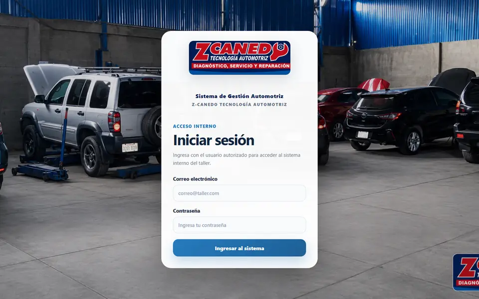
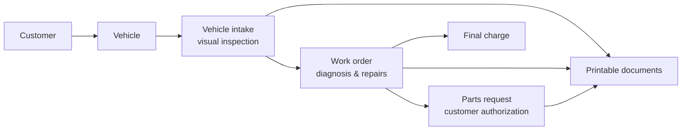
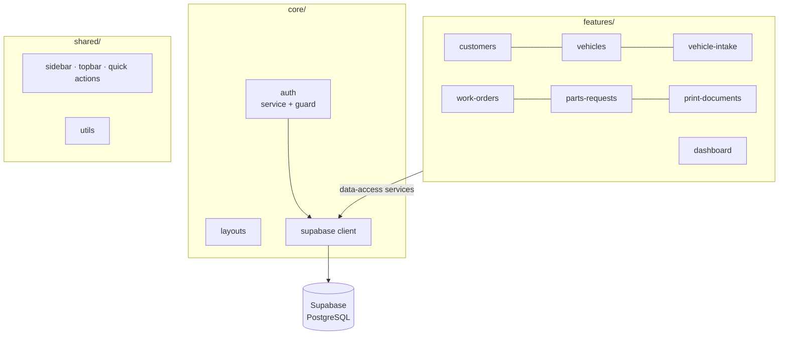
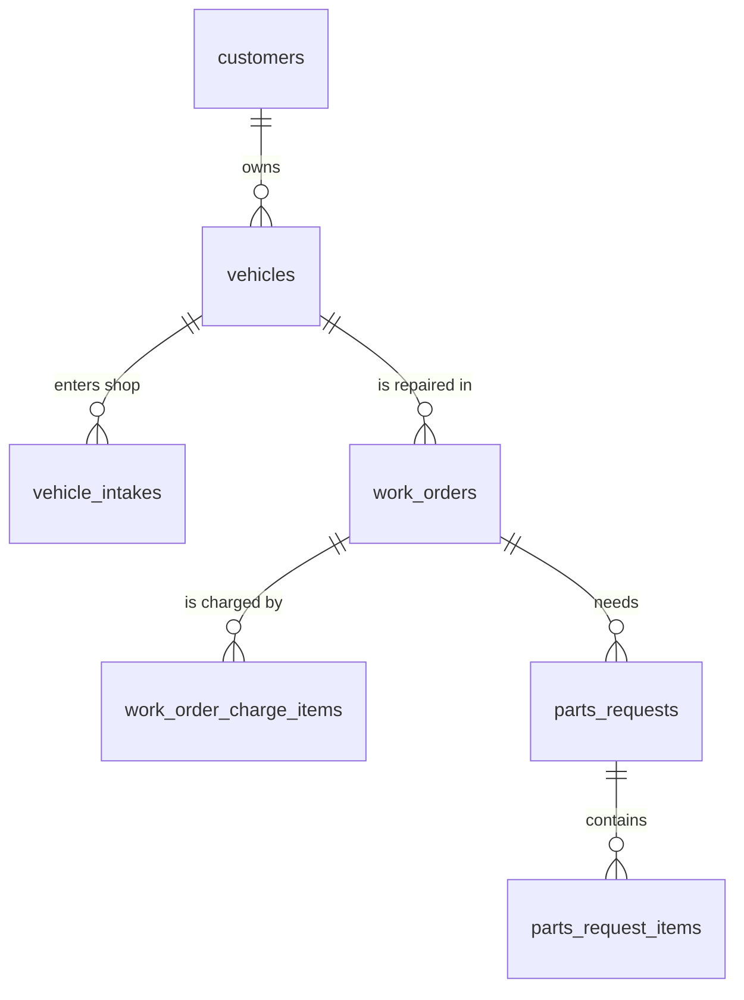

# Z-Canedo — Automotive Workshop Management System

Web application for the daily workflow of an automotive repair shop: from the moment a vehicle arrives, through diagnosis and repair, to the printed documents handed to the customer.


**Live:** [zcanedo.netlify.app](https://zcanedo.netlify.app/) — internal tool, login required (demo access on request).



---

## The problem

A repair shop needs to know at any moment which vehicles are in the shop, what the customer has authorized, which parts are pending and what to charge at delivery. This system keeps that information in one place, linked from the customer to the final charge.

## What the system does

The application follows the real sequence of work in the shop:



### Implemented

| Module | Highlights |
|---|---|
| **Authentication** | Supabase Auth login, session handling, user menu, route guard that returns the user to the requested page after login |
| **Dashboard** | Live workshop overview loaded from the database |
| **Customers** | Customer management with linked vehicles |
| **Vehicles** | Vehicle records (plate, brand, model, owner) and customer–vehicle relationship |
| **Vehicle intake** | Reception form with smart vehicle search, assigned mechanic and a visual inspection / inventory checklist |
| **Work orders** | Diagnosis, requested and completed work, status actions, service and parts breakdown, final charge details |
| **Parts requests** | Parts requested for a work order, item lists, history and authorization flow |
| **Printable documents** | Reception receipt, work order and parts request templates with print-optimized layouts |

### Planned

Reports · Inventory · Payments · Settings (routes exist as placeholders).

---

## Architecture

Domain-oriented structure: each business area owns its pages, components, models and data access. Shared UI and cross-cutting concerns live in `shared/` and `core/`.



```
src/app/
├── core/          auth, layouts, Supabase client
├── features/      one folder per business domain
│   └── <domain>/
│       ├── pages/         routed, lazy-loaded screens
│       ├── components/    domain UI pieces
│       ├── models/        TypeScript types
│       └── data-access/   Supabase queries for the domain
└── shared/        reusable UI and utilities
```

### Data model (main tables)



### Technical decisions

- **Standalone components + lazy-loaded routes** — each screen is loaded on demand, keeping the initial bundle small.
- **Data access isolated per domain** — Supabase queries live in `data-access/` services, so pages don't talk to the database directly.
- **Supabase as backend** — managed PostgreSQL, authentication and APIs without running a custom server, which keeps the infrastructure simple for a small business.
- **Print templates as code** — documents are generated from typed models, so printed output always matches the stored data.

---

## Engineering workflow

- Feature branches (`feature/*`, `fix/*`, `setup/*`) merged through **pull requests** — 14 merged so far.
- [Conventional commits](https://www.conventionalcommits.org/) (`feat:`, `fix:`, `chore:`, `docs:`).
- Deployed to Netlify with SPA redirects (`_redirects`).

## Security notes

- The frontend only uses Supabase's **publishable** key, which is designed to be public. No secret keys are stored in the repository.
- Access to the application requires authentication.
- Row Level Security policies for every table are on the roadmap.

---

## Getting started

```bash
git clone https://github.com/OmarArgenes/mecanica-automotriz-web.git
cd mecanica-automotriz-web
npm install
npm start          # http://localhost:4200
```

Configure your own Supabase project in `src/environments/environment.ts`:

```ts
export const environment = {
  production: false,
  supabaseUrl: 'https://<your-project>.supabase.co',
  supabaseAnonKey: '<your-publishable-key>',
};
```

## Roadmap

- [ ] Row Level Security policies for all tables
- [ ] Reports module
- [ ] Inventory and payments
- [ ] Unit tests for data-access services
- [ ] Settings

---

**Author:** [Omar Argenes Quispe](https://github.com/OmarArgenes) · [Portfolio](https://omar-argenes.netlify.app/)
